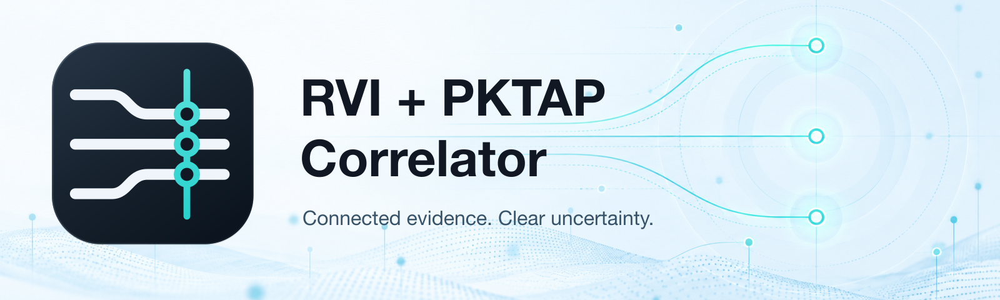
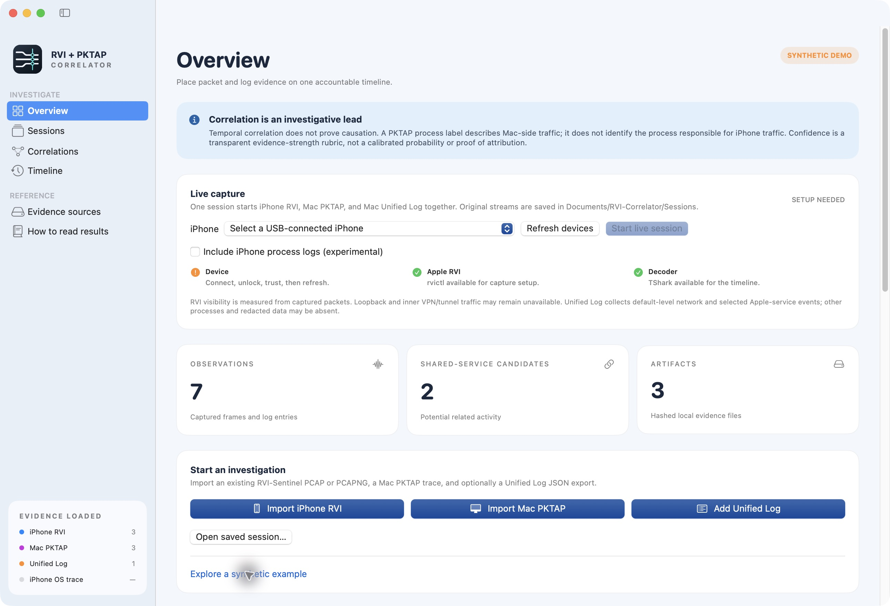

# RVI + PKTAP Correlator

### Native SwiftUI investigation of iPhone traffic, Mac process-aware packets, and Unified Log evidence

<p align="center">
  
</p>


> **Scope:** A local investigation companion to [RVI-Sentinel for macOS](https://github.com/hideouts-io/RVI-Sentinel-Swift). Bring iPhone RVI packets, Mac PKTAP packets, and Mac Unified Log events into one timeline, then inspect possible relationships with their evidence and uncertainty. **Temporal correlation does not prove causation. Mac process labels do not identify the process responsible for iPhone activity.**

---

## Table of Contents

- [Overview](#overview)
- [Native App Screenshots](#native-app-screenshots)
- [What It Does](#what-it-does)
- [Architecture](#architecture)
- [Requirements](#requirements)
- [Build and Run](#build-and-run)
- [Live Capture and Health](#live-capture-and-health)
- [Import and Saved Sessions](#import-and-saved-sessions)
- [Investigation Walkthrough](#investigation-walkthrough)
- [Protocol Coverage](#protocol-coverage)
- [DNS and Hostname Provenance](#dns-and-hostname-provenance)
- [Correlation and Process Attribution](#correlation-and-process-attribution)
- [Unified Log Evidence](#unified-log-evidence)
- [Clock Alignment](#clock-alignment)
- [Evidence Files and Privacy](#evidence-files-and-privacy)
- [Validation and Experimental Status](#validation-and-experimental-status)
- [Troubleshooting](#troubleshooting)
- [Testing](#testing)
- [Repository Structure](#repository-structure)
- [Relationship to RVI-Sentinel](#relationship-to-rvi-sentinel)
- [Licensing and Dependencies](#licensing-and-dependencies)

---

## Overview

RVI tells an investigator what was visible at the iPhone's remote capture interface. PKTAP adds process, interface, and direction metadata to Mac traffic. Unified Log can provide context about Mac services and connections. The Correlator preserves those distinctions while placing observations on a shared timeline.

Two separate relationship views answer different questions:

| Review | Question | Meaning |
|---|---|---|
| Shared-service candidates | Did both devices communicate with the same remote endpoint near the same time? | A scored investigative lead, with competing processes and limitations. |
| TCP direct-peer review | Do packets on both sides have a defensible matching header fingerprint? | An inferred, **unscored** packet relationship; not proof of process ownership, causation, or payload identity. |

Capture and decoding have been exercised on a physical iPhone. Correlation remains **experimental**: scores are a transparent evidence-strength rubric, not calibrated probabilities. Zero qualifying relationships can be a valid result.

## Native App Screenshots

These are screenshots of the packaged native app. Analysis screenshots use its **SYNTHETIC DEMO**, containing fabricated packet and log records. Example process labels, hostnames, and addresses are illustrative; they are not observations of Apple service behavior or evidence from a private device.

### Branded overview and capture readiness



This real screenshot of the packaged development preview shows the selected **Aligned Evidence** identity, separate device/RVI/decoder readiness, import controls, and the labeled synthetic demonstration. It is a setup state, not a running capture or a claim of zero packet loss. The development preview also shows the local session-navigation and optional iPhone-log work; publication of those capabilities is separate from this artwork update.

Candidate explanations, focused evidence review, and the interpretation guide are described in the [investigation walkthrough](#investigation-walkthrough). The preserved screenshots with the previous branding remain under `assets/branding-v1/screenshots/`.

---

## What It Does

- Starts iPhone RVI, Mac PKTAP, and a targeted Mac Unified Log stream in one bounded session.
- Discovers paired physical devices through CoreDevice and verifies their serials against the current USB I/O Registry; excludes simulators. A developer tunnel is not an RVI prerequisite.
- Decodes growing PCAPNG files with separately installed TShark and refreshes the timeline during capture.
- Imports existing PCAP/PCAPNG captures, including RVI-Sentinel output, and UTF-8 Unified Log JSON Lines.
- Reads both raw PKTAP headers and Apple PCAPNG process/interface/direction options.
- Preserves original timestamps, capture records, source identity, hashes, and clock adjustments.
- Associates captured DNS answers with flows using source, client, CNAME chain, and TTL boundaries.
- Explains shared-service candidates, rejected initiations, competing processes, and missing evidence.
- Reviews possible TCP direct-peer traffic independently of shared-service scoring.
- Groups direction-independent TCP/UDP five-tuples into packet sessions within one capture artifact, interface, process label, and decoder stream; cross-device relationships remain separate inferred links.
- Opens a saved frame's original bytes on demand and highlights decoded field ranges only when TShark's reported range matches the captured bytes exactly. Fields without verified ranges remain explicitly unmapped.
- Links relationship records to a focused timeline and supports returning to the expanded peer group.
- Saves original evidence locally and checks finalized session manifests before reopening.
- Offers optional, explicitly initiated current DNS/PTR lookup, separate from captured evidence and scores.

## Architecture

```text
iPhone via Apple RVI       Mac via PKTAP          Mac Unified Log
         |                     |                       |
    Original PCAPNG       Original PCAPNG          Raw NDJSON
         |                     |                       |
         +---- TShark protocol/metadata decoding ------+
                               |
               Source-scoped normalization and provenance
                               |
          DNS / TLS / QUIC / process / interface / log evidence
                               |
                     Normalized timeline
                               |
          +--------------------+---------------------+
          |                                          |
  Shared-service candidates                  TCP direct-peer review
  Explained evidence strength                Inferred, unscored pairs
          |                                          |
          +---------------- Investigator view --------+
                         Evidence and uncertainty
```

The app uses Foundation, SwiftUI, AppKit, and CryptoKit. It has no third-party Swift package dependencies. Packet dissection runs through the external `tshark` executable; the app does not bundle Wireshark.

## Requirements

| Requirement | Purpose and limits |
|---|---|
| macOS 14+ | Deployment target. Validation has been on an Apple silicon development Mac; this is not a claim that every supported OS/hardware combination was tested. |
| Swift 6 toolchain | Build the Swift package and native app bundle. |
| Xcode with CoreDevice/device support | Live discovery uses `xcrun devicectl`; Command Line Tools alone may not supply device support or `rvictl`. |
| Apple `rvictl` | Creates the remote virtual interface. The app searches `/Library/Apple/usr/bin/rvictl` and supported system locations. |
| TShark from [Wireshark](https://www.wireshark.org/download.html) | Required for real and synthetic packet import. Searches `/Applications/Wireshark.app/Contents/MacOS/tshark`, `/opt/homebrew/bin/tshark`, then `/usr/local/bin/tshark`. Validation used TShark 4.6.9. |
| Paired, trusted iPhone on USB | Required only for live RVI capture. Connect, unlock, and accept the device's Trust prompt. Network-only discovery does not qualify. |
| macOS administrator authorization | The native authorization prompt launches the bounded capture helper. Do not run the whole GUI as root. |
| Writable Documents folder and sufficient disk space | Original evidence is saved locally. Allow Documents access if macOS requests it. |

Apple's [packet-trace documentation](https://developer.apple.com/documentation/network/recording-a-packet-trace) describes RVI setup. Installing Command Line Tools is not a guarantee that `rvictl` has been installed. Use Apple's supported Xcode/device-support installation and verify the app's readiness checks.

## Build and Run

```sh
git clone https://github.com/hideouts-io/RVI-Correlator.git
cd RVI-Correlator
./scripts/build-app.sh
open 'dist/RVI + PKTAP Correlator.app'
```

The script creates a release build, bundles the capture helper and demo resources, and includes the approved **01 · Aligned Evidence** icon for the app, Finder, and Dock. The [branding inventory](assets/branding-v2/ASSET-MANIFEST.md) includes editable sources, logo treatments, icon sizes, GitHub artwork, and responsive website images. Open the `.app` to use its bundled icon. The source repository does not distribute a notarized installer or prebuilt binary. The build is native to the selected toolchain/host architecture, not a universal binary.

For development and tests:

```sh
swift build
swift test -j 4
```

Use the packaged app for live capture: the helper and app resources must be present beside the GUI executable.

## Live Capture and Health

1. Connect and unlock the iPhone, accept Trust if prompted, then choose **Refresh devices**.
2. Select the physical USB-connected device. Resolve the Device, Apple RVI, and Decoder readiness messages.
3. Leave offsets at **0 ms** and clock verification unchecked unless you already have an independent calibration.
4. Choose **Start live session** and complete native macOS authorization.
5. Check that all collectors remain running and evidence counts increase. Monitor warnings and packet/drop reports.
6. Choose **Stop and finalize**, wait for analysis and manifest creation, then reopen the saved session to check integrity.

The helper creates an `rviN` interface, validates the capture interfaces, and starts macOS `tcpdump` with full snap length, immediate writes, and Apple PCAPNG output. Mac capture uses `pktap`. Unified Log collection runs at default level with a targeted predicate. Collector starts are not simultaneous at hardware precision; their launch separation **does not calibrate clocks**.

| Health signal | Interpretation |
|---|---|
| Collector PID / running status | The collector has started; this alone does not prove packets are arriving. |
| Packet count pending | `tcpdump` has not yet reported a counter; not equivalent to zero. |
| Kernel drops not yet measured | Drop information is unavailable so far. |
| Nonzero kernel drops | Evidence may be incomplete. Preserve the warning with the session. |
| Zero reported kernel drops | That collector reported no kernel drops; does not prove end-to-end completeness. |
| HEALTH UNKNOWN | Monitoring failed. Inspect saved diagnostics; do not assume healthy capture. |
| In-progress hash | Capture is still changing; final integrity information is not available yet. |

Unified Log is not a packet collector, so packet counters do not apply. Default-level selection, privacy redaction, and stream loss can omit useful events.

A collector exit, lost GUI process, 30-minute capture limit, or 1 GB raw-log limit ends capture with an explicit failure. Original files remain available even if finalization fails. Do not treat a directory containing files as a successfully finalized session.

### iPhone interface coverage

Only packet-reported interface names are directly observed. A name establishes visibility for those packets, not complete capture of that interface. The app does not have a comprehensive device-side interface inventory.

Wi-Fi, cellular, Ethernet, tethering, VPN/tunnel, loopback, and other interfaces must be assessed separately. Inner tunnel and loopback traffic may be unavailable even when an outer flow is visible. A missing interface label does not prove the interface was inactive. A separately entitled Network Extension can observe traffic routed through its own tunnel; this application does not implement a device-side all-interface collector.

## Import and Saved Sessions

- **Import iPhone RVI:** choose an existing PCAP or PCAPNG, including output from either RVI-Sentinel edition.
- **Import Mac PKTAP:** choose a capture preserving raw PKTAP headers or Apple PCAPNG metadata. A normal Ethernet capture without process metadata is insufficient for Mac process attribution.
- **Add Unified Log:** import UTF-8 JSON Lines with `timestamp` and `eventMessage`, plus available `processID`, `processImagePath`, `subsystem`, and `category` fields. A `.logarchive` must first be exported with Apple's `log show --style ndjson`.
- **Open saved session…:** choose a finalized folder containing `manifest.json`. Recorded file sizes and SHA-256 hashes must match.

For example, export your own bounded Mac log interval, replacing the example dates:

```sh
/usr/bin/log show --style ndjson --timezone UTC \
  --start '2026-09-29 10:00:00' --end '2026-09-29 10:05:00' \
  > mac-log.ndjson
```

A finalized session can also be opened from Terminal:

```sh
open 'dist/RVI + PKTAP Correlator.app' --args --open-session /absolute/path/to/session
```

A matching manifest establishes consistency with that manifest. It does not authenticate who created the evidence or establish complete capture coverage.

## Investigation Walkthrough

1. **Learn with the demo.** Select **Explore a synthetic example**. It loads fabricated DNS, TLS, PKTAP, and log records through the real import/correlation path. The app labels the result **SYNTHETIC DEMO**.
2. **Collect a bounded session.** Establish a quiet baseline, then perform one identifiable action at a time on the iPhone and Mac. Record actions separately as investigator notes. Action times are not clock-calibration references.
3. **Check coverage before interpretation.** Review collector warnings, reported drops, source counts, and interface labels. Preserve partial failures.
4. **Inspect the timeline.** Filter by source or search hostname, process, protocol, or IP. Open a row for original/adjusted time and observed fields.
5. **Review relationships.** Inspect shared-service candidates and TCP peer partitions separately. Read score components, contradictions, alternatives, and missing evidence. Use cited-record links and **Return to relationship** for peer review.
6. **Investigate zero results.** Review initiation rejection reasons and nearest endpoint evidence. Different endpoints or events outside the search window can legitimately yield no candidates. Do not widen the window just to produce results.
7. **Preserve a handoff.** Finalize the session, verify reopening, and use **Export investigation JSON…** under Evidence sources. Share evidence only after a separate privacy review.

## Protocol Coverage

Dissection depends on the bytes captured and fields supplied by the installed TShark version. Decoding a protocol is not equivalent to decrypting it or proving a relationship.

| Protocol | Retained or analyzed metadata | Principal limit |
|---|---|---|
| Ethernet | Source/destination MAC, EtherType | Not all capture link types contain Ethernet. |
| ARP | Operation and IPv4 protocol addresses | Local-link evidence only. |
| IPv4 / IPv6 | Addresses and protocol/next-header values | Translated or nested endpoints require care; peer review rejects multiple IP layers. |
| ICMP / ICMPv6 | Message type and network endpoints | Not process ownership evidence. |
| TCP | Ports, stream, raw sequence/ACK, flags, payload length | Offload, segmentation, retransmissions, and missing packets can prevent pairing. |
| UDP | Ports and stream metadata | No implemented UDP direct-peer identity matcher. |
| DNS / mDNS / LLMNR | Queries, structured answers, A/AAAA, CNAME, TTL, response flags | Only supported address/alias answer records feed DNS associations; encrypted DNS remains opaque. |
| TLS | Visible ClientHello, SNI, ALPN, version fields, visible certificate metadata | No ECH inner name or encrypted TLS 1.3 certificate recovery. |
| HTTP/1 | Host, request method/URI, response code when visible | HTTPS contents are not automatically decrypted. |
| STUN | Message type and transaction ID | Does not establish which application caused iPhone traffic. |
| QUIC | Versions, source/destination connection IDs, long-header type, packet number/token length where exposed, recoverable Initial ClientHello | Recovery depends on decoder and captured handshake bytes. Connection IDs or timing alone are not peer identity. |

## DNS and Hostname Provenance

The inspector distinguishes **captured DNS**, **TLS SNI**, **HTTP Host**, **recoverable QUIC ClientHello**, inferred flow inheritance, and optional current lookup.

DNS associations stay within the capture artifact and client address. CNAME chains use the intersection of record validity intervals; newer observed RRsets supersede older records. Expired records do not silently remain valid, and multiple names sharing an IP remain ambiguous. Mac DNS results are not automatically applied to iPhone flows.

Flow inheritance uses prior evidence within five minutes on the same stream, interface, and process identity. It is an inference about that flow, not proof of the hostname for each subsequent request. ECH, encrypted DNS, caching, missed answers, and captures beginning after connection establishment can explain missing names.

**Look up now** explicitly queries the Mac's configured resolver for current A/AAAA or PTR information. Lookup time and results remain separate, do not change scores, and cannot establish which hostname was used during an earlier capture. Passive import does not initiate these lookups.

## Correlation and Process Attribution

### Shared-service candidates

Candidate selection requires a matching remote IP, remote port, transport, and configured time window. Derived endpoints require one coherent IP header and one unambiguous TCP/UDP header. Mixed or repeated layers, including identical repeated values, remain available in raw fields but cannot participate in endpoint scoring or session grouping. Direction determines the remote endpoint. Mac `rvi` frames are excluded because they may mirror iPhone traffic.

The score can incorporate endpoint matches, source-scoped DNS support, flow hostnames/SNI, ALPN, QUIC version, PKTAP labels, and qualifying logs. Time contributes points only with documented alignment and uncertainty compatible with the matching window.

**High** additionally requires eligible clock alignment with at most 50 ms uncertainty, matching host evidence, a labeled outbound Mac process, no competing process, no conflicting/ambiguous hostnames, and the score threshold. Inbound Mac evidence is capped at Low. Contradictions and alternatives are displayed explicitly. See [`Correlate.swift`](Sources/CorrelatorCore/Correlate.swift) for the actual rubric.

Original and effective PKTAP identities remain distinct. Missing/sentinel PIDs are unknown. A packet-time PID/name label does not establish process lifetime or exclude PID reuse. Truncated process names are not merged by resemblance.

### TCP direct-peer review

Pairing requires identical wire endpoints, raw sequence/ACK numbers, payload length and flags, opposite known directions, a non-RVI Mac interface, and a unique match within the search window. A partition needs at least two distinct fingerprints including payload or SYN evidence; repeated ACKs alone are insufficient.

These are header fingerprints, not payload hashes. Forwarding, mirroring, retransmissions, and segmentation/offload differences remain limitations. Partitions preserve capture-local stream, interface, and original/effective process labels. They are not counts of unique processes or user actions. UDP/QUIC peer identity and translated-endpoint equivalence are not implemented.

## Unified Log Evidence

Live collection combines targeted networking/service coverage with host-observed executable names `CoreDeviceService`, `remoted`, `usbmuxd`, and `AMPDeviceDiscoveryAgent`. It does not indiscriminately collect every subsystem or enable private/debug logging.

Normalization retains these device-service events as **context**. Other retained records require a captured Mac PID and a bounded endpoint/hostname token. Retention is not automatically a supporting link. Relationship log support has separate PID, process-name, endpoint, time, and alignment requirements. Original raw records and line references remain available; derived `rviCaptureSelection` annotations are not OS fields.

Imported log identities use physical LF-delimited export lines; supplied source-line annotations are separate, unauthenticated provenance. Fresh normalization generates its own annotations and preserves stable source-line IDs across live refreshes. Normalization streams records with a 1 MB line limit and 64 MB selected-output limit, and preserves the previous normalized artifact on failure. Live snapshots explicitly warn about deferred non-LF-terminated tails. Final normalization consumes a valid terminal record or fails on malformed/truncated input; event timestamps are validated before selection. Only the supported typed `count`/`finished` counter summary is omitted as a summary.

Activity navigation requires original, nonempty boot identity and compatible process/image scope with nonzero activity identifiers. A separate `capture-context.json` records host boot samples, uptime, collection predicate and level. It is never silently substituted into an original log record. Agreeing host samples do not establish per-event identity, process lifetime, causation, or clock alignment.

### Optional iPhone process logs (experimental)

Before capture, enable **Include iPhone process logs**, select an installed `pymobiledevice3` executable, and enter one current **iPhone** process PID. Obtain that PID from the connected device in Console or `idevicesyslog -u <device-udid> pidlist`; do not use a Mac PID. The collector requests that PID from `com.apple.os_trace_relay`, excludes info/debug levels, and uses the same selected device as RVI. A process restart requires a fresh PID and capture. No tool, device profile, private-data entitlement, or jailbreak is installed by the app.

The helper coordinates the optional fourth stream with the other collectors but runs the external logger as the session owner, **not root**, with a clean environment and `TZ=UTC`. It stops the session on a requested collector failure; it does not silently substitute another logging method. iPhone logs have a 60 MB live safety limit. Capture health displays saved bytes and decoded records; dropped-log counts are **unavailable**, not assumed zero.

`iPhone OS trace` is a separate timeline source. Original collector NDJSON and stderr are preserved alongside `ios-log-config.json`, which records the service, requested PID, collector version, launcher hash, and UTC convention. These are collector-rendered records, not raw binary transport or a complete archive. The launcher hash does not attest all of its Python dependencies. A schema-3 manifest hashes all twelve session artifacts; older schema-1/2 sessions still open. Standalone iPhone logs without collection provenance are not imported.

Select an RVI packet to review **iPhone log context**. Only logs bound to the same coordinated session, with a bounded explicit address/observed-hostname mention inside the chosen time window, appear as links. The inspector also counts endpoint mentions outside the window and records without matching mentions. These links are **inferred and unscored**: local/multicast addresses, hostnames, or infrastructure can be shared, and a textual mention does not establish a connection, port ownership, packet ownership, or causation. All admitted records remain visible separately; selecting one permits returning to the RVI packet. iPhone log PIDs never join Mac PKTAP PIDs or increase existing correlation scores.

The tested collector (pymobiledevice3 10.11.0) renders device epoch timestamps as naive host-local text. Launching it with `TZ=UTC` makes that conversion explicit; original strings and derived epoch microseconds remain distinct. Offset stays **0 ms, alignment unverified**. Monotonic ticks are retained without conversion because boot identity and timebase are unverified. No boot UUID or activity ID is invented from `procid`, image UUIDs, or host metadata. This stream cannot establish a process lifetime or cross-device activity identity.

**Method names are not interchangeable.** Unified Logging is the device's logging system; `Logger`/`OSLog` write to it, and `OSLogStore` reads a supported local or archived store. None is a public API for this Mac app to stream another iPhone's system-wide logs. `com.apple.os_trace_relay` and `com.apple.syslog_relay` are different device transports. DVT is an Instruments service family with both an activity-trace log tap and a separate network monitor, not a synonym for Unified Logging or syslog.

| Method | Evidence value and limits | App status |
|---|---|---|
| Apple Console connected-device logging | Apple documents viewing live iPhone messages. Privacy redaction and logging policy still apply; Console is a viewer, not a documented remote streaming SDK for this app. | External reference workflow. |
| `Logger` / `OSLog` / `OSLogStore` | Public Apple APIs to emit logs and read supported stores, including a `.logarchive`; they do not grant this Mac app a live, system-wide iPhone log stream. | No replacement for the device collector. |
| OS trace relay via pymobiledevice3 | Structured process, subsystem/category, image and timestamp context. Third-party device protocol; available fields and reliability vary by tool/iOS release. | Optional process-scoped integration; live four-stream collection, shutdown, finalization and reopening verified on one iPhone running iOS 26.3.1. |
| DVT activity-trace / `developer dvt oslog` | Instruments channel can expose logs and signposts, but iOS 17+ requires a developer tunnel. The installed 10.11.0 CLI stamps JSON with `datetime.now()` on the Mac, not the original device event time, and labels the command unstable. | Not integrated; its current CLI output is unsuitable for precise packet-time correlation. |
| DVT network monitor / `developer dvt netstat` | A different Instruments channel reports device PID, local/remote socket addresses and ports, and interface index. This could add stronger **device-side endpoint evidence** than message text, but its CLI output lacks an original event timestamp and it requires a working iOS 17+ tunnel. | Candidate for a separate bounded experiment, not validated or integrated. |
| Legacy `com.apple.syslog_relay` text stream | Useful messages, but not equivalent structured Unified Log metadata; parsing and timestamp context need a different importer. Modern idevicesyslog 1.4.0 defaults to OS trace relay; `--syslog-relay` explicitly selects legacy mode. | Not a fallback and not integrated. |
| Offline `.logarchive` | Apple `log collect --device-udid` supports bounded retrospective collection on the tested Mac. An archive can retain more event types and metadata than this process-scoped live export, subject to retention, logging policy and redaction. | Collection and device-archive import are not integrated. Existing Mac NDJSON import must not be used to relabel device logs. |
| Offline sysdiagnose | A broader, sensitive diagnostics bundle that normally includes `system_logs.logarchive`; useful when a specific live investigation lacks context. It is not a live stream or a guarantee of unredacted network endpoints. | Manual external workflow only. |

For live logging, keep the existing optional, process-scoped OS trace relay. The short physical session's 52 records, including 14 masked messages, gave **zero qualifying packet-to-log links**. A broader stream or different log transport does not by itself establish packet ownership. Prefer a targeted offline device archive for retrospective review; test DVT network telemetry separately if a developer tunnel becomes available. Keep its device PID and endpoints separate from Mac PKTAP process identity, and require independent evidence before linking records.

Sources: [Apple Unified Logging](https://developer.apple.com/documentation/os/logging/), [Apple OSLogStore](https://developer.apple.com/documentation/oslog/oslogstore), [Apple Console connected-device guide](https://support.apple.com/guide/console/log-messages-cnsl1012/1.1/mac/27), [Apple sysdiagnose guidance](https://developer.apple.com/forums/thread/739560), [pymobiledevice3 OS trace implementation](https://github.com/doronz88/pymobiledevice3/blob/master/pymobiledevice3/services/os_trace.py), [DVT services and tunnel requirements](https://github.com/doronz88/pymobiledevice3/blob/master/docs/api/dvt.md), [DVT log CLI](https://github.com/doronz88/pymobiledevice3/blob/master/pymobiledevice3/cli/developer/dvt/__init__.py), [DVT network monitor](https://github.com/doronz88/pymobiledevice3/blob/master/pymobiledevice3/services/dvt/instruments/network_monitor.py), [idevicesyslog manual](https://github.com/libimobiledevice/libimobiledevice/blob/master/docs/idevicesyslog.1). Installed `log help collect` and `log help stream` distinguish native archive collection from local live streaming; no remote-device option was found in the latter.

## Clock Alignment

Start with **0 ms offsets** and **alignment unverified**. The default 250 ms matching window is a search tolerance. The initial 1,000 ms uncertainty is an explicitly labeled placeholder, not a measured accuracy estimate.

```text
offset = reference timestamp - source timestamp
adjusted timestamp = original timestamp + offset
```

A positive offset moves a stream later. Original timestamps remain unchanged. Container resolution is shown separately from clock origin and accuracy; files alone may not establish either.

The calibration worksheet requires at least two independently identifiable source/Mac reference pairs, the identification method, and measurement uncertainty. It calculates a constant correction, residuals, combined uncertainty, and observed drift. Applying a correction does not automatically mark alignment verified. Timing support is disabled outside a calibration's measured interval or if its offset no longer matches. Drift is reported, not silently corrected.

Do not calibrate from similar traffic, collector launch timing, user-action timing, or by maximizing match counts.

## Evidence Files and Privacy

During live capture, root writes only to `/Library/Application Support/RVI-Correlator/Captures/<uid>/<session-id>/`, behind root-owned ancestors and a read/search ACL for the requesting user. The helper rejects symlinks, writable ancestors and ACL mutation grants, and creates stream files exclusively through directory descriptors. The app writes stop requests and normalized logs as the user in `~/Documents/RVI-Correlator/Sessions/<session-id>/`. After a clean stop, it copies and verifies the captured files into that Documents folder before finalizing the manifest. Protected originals remain preserved; a failed copy can be retried. Finder opens the protected evidence while capture is live, and the Documents copy after finalization. This privilege-boundary change has local filesystem tests; fresh administrator-authorized capture remains unverified.

| Artifact | Purpose |
|---|---|
| `iphone-rvi.pcapng` / `mac-pktap.pcapng` | Original packet evidence. |
| `unified-log.raw` | Original collected log stream. |
| `unified-log.ndjson` | Derived selected records with original line references. |
| `capture-context.json` | Separately sourced host/session metadata. |
| `status.json` and collector diagnostics | Capture phase, reported counters, errors and helper diagnostics. |
| `manifest.json` | Final file sizes, SHA-256 hashes, capture status, and coverage. |
| Exported investigation JSON | Observations, original/adjusted times, settings, evidence reasons, peer relationships, and separate current lookups/context. |

There is no capture/report upload workflow. Explicit current DNS lookups can disclose the queried name or address to the configured resolver. Captures, logs, exports, hashes, identifiers, hostnames, and paths may be sensitive even when payloads are encrypted.

The repository excludes real captures, recovered sessions, private validation reports, logs, credentials, and build products. The only capture-format files included are explicitly allowlisted, fabricated demo/test fixtures. Their Apple-like names and process labels are examples, not captured Apple behavior. Review exports separately before sharing; `.gitignore` is not a complete data-loss prevention system.

Use the app only on devices and networks you own or are authorized to investigate.

## Validation and Experimental Status

A preserved **77-second physical-iPhone session on 2026-09-29 UTC** completed live decoding, clean stop, schema-2 finalization, hash verification, and reopening. Private originals and detailed audit reports are intentionally not published.

Optional iPhone logging was exercised in a separate short capture on **2026-09-30 UTC**: all four streams arrived, stopped, finalized with twelve matching manifest hashes, and reopened in the packaged app. Its 52 iPhone `mDNSResponder` records provided service context but **zero qualifying endpoint-context links**; hostname masking limited evidence. This does not validate every process, iOS version, disconnect scenario, interface, or positive attribution case. The external logger's drop count remains unknown.

| Evidence in that bounded validation | Result |
|---|---|
| iPhone / Mac packets | 6,780 / 43,444 |
| Raw / normalized log records | 49,939 / 4,244 |
| Total normalized observations | 54,468 |
| Shared-service candidates | 0: 41 eligible initiations lacked matching Mac endpoints; 10 were outside the unchanged window. |
| TCP peer review | 15 partitions; 182 packet pairs; two partitions had both directions. |
| Qualifying peer log support | 0; retained service context did not qualify as supporting evidence. |
| Collector kernel drops | Both reported zero; not proof of complete collection. |
| Clock alignment | 0 ms offsets, unverified. |
| Final evidence integrity | All nine manifest-listed files matched size and SHA-256. |

Packet metadata named `pdp_ip0`, `utun6`, and `en2`. Those are observed labels, not a verified mapping of all device interfaces. TShark identified iPhone TCP, UDP, IPv4/IPv6, Ethernet, DHCP, ICMPv6, mDNS, TLS, and QUIC. Fourteen frames exposed ClientHello SNI, including ten QUIC frames. These counts do not prove protocol coverage across all scenarios.

A preceding failed run exposed an mDNS import defect, which was repaired and replayed successfully. That run also hit an atomic status-write permission error: reporting now surfaces the failure as unknown health, but its underlying permission cause remains unresolved. It did not recur in the short successful retry. Long-duration reliability remains unverified.

All raw log records in the successful run had empty boot UUIDs. The sidecar remains separate, and automatic boot-scoped activity grouping remains unavailable for those records. Requested iPhone browser actions/interface mode were not independently confirmed, so no action-to-packet attribution is claimed.

**Verified in bounded tests:** raw PKTAP and Apple PCAPNG import, synthetic DNS/TLS evidence behavior, short physical capture/finalization/reopen, preserved replay, and packaged UI review.

**Partial or experimental:** relationship inference, heuristic confidence, process association beyond the observed Mac label, targeted log support, and interface coverage.

**Unverified:** complete Wi-Fi/cellular/Ethernet/VPN/tethering/loopback coverage, end-to-end loss measurement, independently measured cross-device clock correction, UDP/QUIC peer identity, and long-running capture reliability. No accuracy benchmark or calibrated causal attribution is claimed.

## Troubleshooting

| Symptom | Check or next step |
|---|---|
| `rvictl` missing | Check `/Library/Apple/usr/bin/rvictl`; complete Apple's Xcode/device-support installation. A PATH check or Command Line Tools installation alone is insufficient. |
| Device unavailable / transport unknown | Refresh after connecting and trusting the physical iPhone. Readiness requires a paired physical CoreDevice record plus a matching current Apple USB serial. An unavailable CoreDevice developer tunnel alone does not block RVI; the actual RVI service is verified at start. See [Apple's RVI setup](https://developer.apple.com/documentation/network/recording-a-packet-trace). |
| TShark missing or decoder field unavailable | Install Wireshark/TShark at a supported path; inspect the exact missing-field diagnostic. Do not interpret a decode failure as no network activity. |
| Mac packets but no process metadata | Verify raw PKTAP headers or Apple PCAPNG process options were preserved. A filename extension alone does not establish metadata coverage. |
| Live refresh failed | Preserve capture files and diagnostics; distinguish decoder failure from stopped collectors. Do not assume all streams are healthy. |
| HEALTH UNKNOWN / status-write error | Preserve `helper.error`, status and collector diagnostics. The prior permission failure's cause remains unresolved; do not broadly change directory permissions to mask it. |
| Zero candidates | Review rejection counts, endpoints, directions, hostname visibility, and clock uncertainty. Zero is not automatically a bug. |
| No hostname | Check for encrypted DNS, ECH, missed DNS replies or handshakes, and a late capture start. Current PTR is not historical evidence. |
| Empty log boot UUID | Keep activity grouping unavailable; a host-session sidecar must not become a fabricated per-event identifier. |
| Manifest mismatch | Preserve the original folder. Investigate the named file and expected/actual hash or size; do not regenerate a manifest merely to bypass the check. |
| Generic Dock icon | Open the packaged `.app`, not the raw executable. Quit and reopen after rebuilding; confirm you are launching the intended copy. |

Import uses 50,000-frame decoder batches. Each decoder pass drains bounded pipes with 256 MB stdout, 1 MB stderr and a 120-second monotonic deadline; termination escalates to SIGKILL after a bounded grace period. Each packet artifact is limited to 500,000 records and 256 MB of cumulative JSON or estimated retained field storage, including field/value overhead. Live and final merges enforce the same per-artifact budget; two packet sources can each consume that budget. Structured DNS answers are bounded before retention. These allocation budgets do not measure Swift or TShark resident memory. Normalized log input is bounded to 64 MB and scoring to 20,000 candidate pairs. Exceeding a bound is an explicit error, not silent evidence truncation.

## Testing

```sh
swift test -j 4
```

The current suite contains **22 regular tests** and five opt-in physical-evidence audits. Tests exercise TShark import on fabricated packets, DNS expiry/scoping, PKTAP forms, clock handling, peer ambiguity, log normalization, host context, and iPhone timestamp validation. Private device-log replay, USB-registry replay, and four-stream replay use `RVI_IOS_LOG_AUDIT`, `RVI_USB_AUDIT`, and `RVI_IOS_SESSION_AUDIT` / `RVI_IOS_SESSION_REPORT` respectively; the audit paths must refer to retained local evidence. A passing synthetic suite is not fresh physical-device validation.

For your own preserved session, run the opt-in replay with explicit private paths:

```sh
RVI_AUDIT_SESSION=/absolute/path/to/session \
RVI_AUDIT_OUTPUT=/absolute/path/to/private-audit.json \
swift test -j 4 --filter physicalSessionAudit
```

The audit reads existing evidence and writes the requested report; it does not create a live capture. Keep that report private. Do not commit machine-generated test output containing local paths.

## Repository Structure

```text
Package.swift                 SwiftPM library, GUI, helper, and tests
Sources/CorrelatorCore/        Decoding, evidence models, clocks, correlation
Sources/CorrelatorApp/         SwiftUI investigation and live-session workflow
Sources/CorrelatorApp/Samples/ Fabricated, labeled demonstration records
Sources/CaptureHelper/        Bounded authorized macOS collectors
Tests/CorrelatorCoreTests/     Behavior/integration tests and tiny fixtures
scripts/                      App packaging
assets/                       Approved logo and real app screenshots
```

## Relationship to RVI-Sentinel

| Project | Focus |
|---|---|
| [RVI-Sentinel-Swift](https://github.com/hideouts-io/RVI-Sentinel-Swift) | Native macOS iPhone capture, evidence review, and network baselines. |
| [RVI-Sentinel](https://github.com/hideouts-io/RVI-Sentinel) | Separate Python capture/analysis project with cross-platform workflows. |
| **RVI + PKTAP Correlator** | Companion focused on relationships between iPhone packets, Mac process-aware packets, and Mac log evidence. |

The integration boundary is existing PCAP/PCAPNG evidence and the established Apple RVI/tcpdump capture approach. This is a separate app, not an embedded RVI-Sentinel module or a replacement for either edition. It does not inherit every feature of those projects.

## Licensing and Dependencies

The project code, documentation, and approved Correlator logo are available under the [MIT License](LICENSE). Copyright (c) 2026 hideouts-io.

Wireshark/TShark is separately installed and licensed under GPL version 2 or later; it is not redistributed here. Optional iPhone logging invokes a separately installed [pymobiledevice3](https://github.com/doronz88/pymobiledevice3) executable (tested 10.11.0; GPL-3.0-or-later); its source and dependencies are not bundled or copied into this app. Apple developer/system tools remain subject to Apple's terms. `Package.swift` declares no external Swift packages. The approved Aligned Evidence branding includes original PNG, SVG, and ICNS assets. The app uses the icon and sidebar image, the README uses its banner and real packaged preview, and packaging preserves the ICNS payloads unchanged. Previous artwork is retained under `assets/branding-v1/`. It is not an Apple or Wireshark logo.
